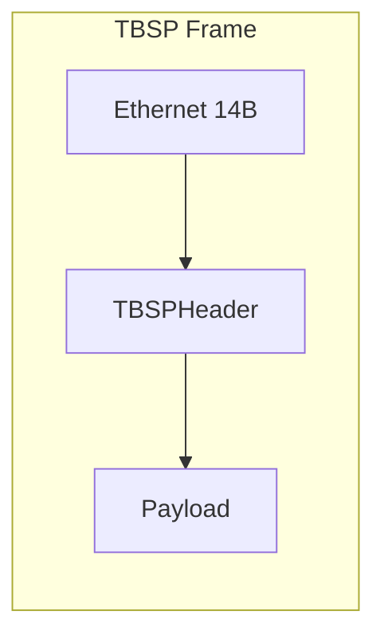

<!-- style: font-family: Arial; font-size: small; -->

# Thunderbolt Streaming Protocol (TBSP)

## 1. Starting point

Goal: Develop a network protocol to accelerate data transfer for streaming over a macOS Thunderbolt bridge.

---

## 2. Variants

- Variant A: RDMA-inspired over DriverKit (kernel driver + user-space ring buffer)
- Variant B: User-space shared memory / zero-copy
- Variant C: Raw Ethernet protocol (Layer 2, custom protocol)

The project uses Variant C (Raw Ethernet). Variant A is documented as reference only.

---

## 3. Variant A – RDMA-inspired (reference only)

### Architecture

- DriverKit system extension: Allocate DMA-capable memory and export it
- User-space library: Lock-free ring buffer, rdma_write() / rdma_read()
- Control plane: Handshake and memory exchange

### Shared memory layout

See [include/shared_region.h](include/shared_region.h): SharedRegion, REGION_SIZE, SLOT_SIZE, NUM_SLOTS, next_index().

### DriverKit skeleton (MyTBRDMADriver)

```c
#include <DriverKit/IOUserService.h>
#include <DriverKit/IOBufferMemoryDescriptor.h>

class MyTBRDMADriver : public IOUserService
{
    OSDeclareDefaultStructors(MyTBRDMADriver)
private:
    IOBufferMemoryDescriptor* dmaBuffer;
public:
    virtual kern_return_t Start(IOService* provider) override;
    virtual void Stop(IOService* provider) override;
    kern_return_t AllocateDMARegion(uint64_t size, uint64_t* outAddress);
};
```

### User-space ring buffer

```c
#include <stdatomic.h>
#include "shared_region.h"

SharedRegion* region;

void rdma_init(void* mapped_addr) { region = (SharedRegion*)mapped_addr; }

int rdma_write(const void* data, size_t len) {
    uint64_t prod = region->producer_index;
    uint64_t cons = region->consumer_index;
    if (next_index(prod) == cons) return -1;
    void* slot = region->data + (prod * SLOT_SIZE);
    memcpy(slot, data, len);
    atomic_thread_fence(memory_order_release);
    region->producer_index = next_index(prod);
    return 0;
}

int rdma_read(void* out) {
    uint64_t prod = region->producer_index;
    uint64_t cons = region->consumer_index;
    if (cons == prod) return -1;
    void* slot = region->data + (cons * SLOT_SIZE);
    memcpy(out, slot, SLOT_SIZE);
    atomic_thread_fence(memory_order_acquire);
    region->consumer_index = next_index(cons);
    return 0;
}
```

---

## 4. Raw Ethernet protocol – TBSP

- Layer 2 over Thunderbolt bridge
- EtherType: 0x88B5 (experimental use)
- Header: Sequence number, ACK, window size, timestamp
- Flow control: Sliding window
- Payload: Jumbo frames (MTU 9000 recommended)

### Header definition

See [include/tbsp_common.h](include/tbsp_common.h):

- TBSP_ETHERTYPE, TBSP_VERSION, MAX_FRAME, WINDOW_SIZE, PAYLOAD_SIZE
- TBSPHeader: version, type (DATA=0, ACK=1), flags, stream_id, sequence, ack, payload_len, window, timestamp_ns
- now_ns() for monotonic timestamps



---

## 5. Minimal sender

Blocking I/O, one frame at a time, sliding-window flow control.

- Source: [src/tbsp_sender.c](src/tbsp_sender.c)
- Usage: sudo ./sender &lt;interface&gt; [dest_mac]

---

## 6. Minimal receiver

Blocking I/O, in-order DATA processing, sends ACK per frame.

- Source: [src/tbsp_receiver.c](src/tbsp_receiver.c)
- Usage: sudo ./receiver &lt;interface&gt;

---

## 7. High-performance sender

Non-blocking, poll loop, batch send (e.g. 32 frames, 8192-byte payload).

- Source: [src/tbsp_sender_hp.c](src/tbsp_sender_hp.c)
- Usage: sudo ./sender_hp &lt;interface&gt;

---

## 8. High-performance receiver

Non-blocking, poll loop, ACK frames.

- Source: [src/tbsp_receiver_hp.c](src/tbsp_receiver_hp.c)
- Usage: sudo ./receiver_hp &lt;interface&gt;

---

## 9. Performance tips

- MTU: Use Jumbo Frames (e.g. ifconfig en5 mtu 9000)
- I/O: Non-blocking + polling
- Batching: Send multiple frames per loop (HP sender)
- Zero-copy: Use a ring buffer when integrating with an app
- CPU: Pin TX/RX threads to cores; separate send and receive paths
- ACKs: Aggregate ACKs (e.g. every N frames or time-based) to reduce overhead

---

## 10. Usage

### Build

```bash
make
```

Produces: sender, receiver, sender_hp, receiver_hp.

### Run (root required)

Raw Ethernet on macOS requires root (BPF access).

Receiver first (e.g. on one machine or interface):

```bash
sudo ./receiver_hp en5
```

Sender (e.g. on the other Thunderbolt bridge end):

```bash
sudo ./sender_hp en5
```

For minimal tools:

```bash
sudo ./receiver en5
sudo ./sender en5
```

Note: Sender and receiver typically run on different hosts (Thunderbolt bridge) or use two different interfaces; one BPF device is bound to one interface at a time.

---

## Project layout

- TBSP/
  - README.md
  - Makefile
  - include/
    - tbsp_common.h (TBSP protocol header)
    - shared_region.h (Variant A reference)
  - src/
    - tbsp_sender.c
    - tbsp_receiver.c
    - tbsp_sender_hp.c
    - tbsp_receiver_hp.c
