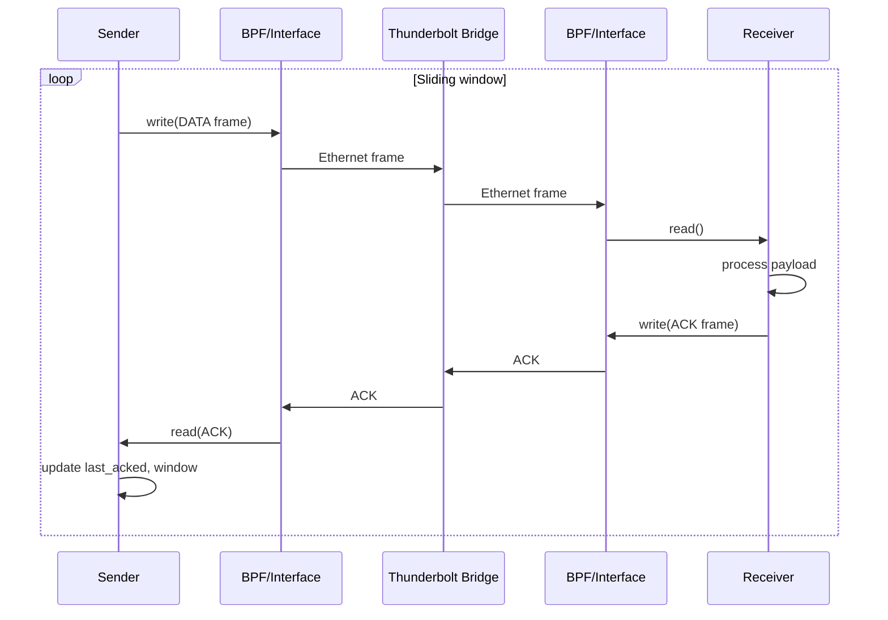

<!-- style: font-family: Arial; font-size: small; -->

# TBSP Architecture

## Variant choice: Raw Ethernet (C)

TBSP implements Variant C: a custom Layer 2 protocol over the Thunderbolt network interface. This avoids kernel/driver complexity (Variant A) and keeps everything in user space with standard BPF on macOS.

## Data flow

## Frame layout

- Ethernet (14 B): destination MAC (6), source MAC (6), EtherType (2) = 0x88B5
- TBSP header: fixed size; fields as in tbsp_common.h
- Payload: variable, up to MTU minus 14 minus sizeof(TBSPHeader)

## Variant A vs C (summary)

| Aspect        | Variant A (RDMA-style)     | Variant C (TBSP)        |
|--------------|----------------------------|--------------------------|
| Kernel       | DriverKit system extension | None                     |
| Memory       | Shared DMA region          | Per-frame copy via BPF   |
| Protocol     | Control plane + ring buffer| Raw Ethernet + sliding window |
| Portability  | macOS DriverKit only       | Any system with BPF/raw L2 |
| Complexity   | High (driver, signing)     | Lower (user space only) |

Variant A is kept as reference in the docs and in shared_region.h for possible future use.
