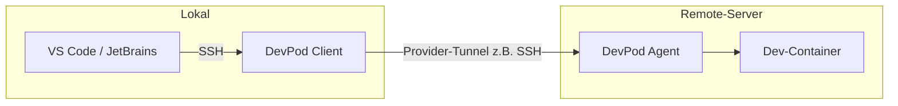

# DevPod: Lokal entwickeln, Remote-Server nutzen

## Ziel-Setup

- **Lokal (Client):** Mac mini, macOS 26.3
- **Remote (Workspace-Host):** Mac Studio, macOS 26.3

DevPod läuft auf dem Mac mini; der Dev-Container soll auf dem Mac Studio laufen (SSH-Provider).

---

## Ablauf (Kurz)

Du arbeitest **lokal** in VS Code oder JetBrains. DevPod startet auf dem **Remote-Server** einen Container (definiert durch [.devcontainer.json](../.devcontainer.json)), richtet dort einen Agent + SSH-Server ein und verbindet deine IDE per SSH mit diesem Container. Code wird also **auf dem Remote-Server** ausgeführt und bearbeitet, gesteuert vom lokalen Rechner.



---

## Deine Werte eintragen

Trage hier deine konkreten Werte ein (oder nutze sie in den Befehlen weiter unten):

| Variable | Beispiel | Dein Wert |
| -------- | -------- | --------- |
| `USERNAME` | Benutzername auf dem Mac Studio | |
| `MAC_STUDIO_HOST` | `mac-studio.local` oder z.B. `192.168.1.100` | |

**Beispiel-Befehl mit deinen Werten (auf dem Mac mini):**

```bash
devpod provider add ssh -o HOST=${USERNAME}@${MAC_STUDIO_HOST}
```

**SSH-Verbindung testen (vor dem ersten `devpod up`):**

```bash
ssh ${USERNAME}@${MAC_STUDIO_HOST}
# Nach erfolgreicher Anmeldung: exit
```

---

## Checkliste vor dem ersten `devpod up`

- [ ] **Mac Studio:** Docker Desktop installiert und gestartet (Docker läuft)
- [ ] **Mac Studio:** Remote-Anmeldung aktiviert (Systemeinstellungen > Freigaben)
- [ ] **Mac mini:** SSH-Key vorhanden (`ls -la ~/.ssh/id_ed25519` oder `id_rsa`)
- [ ] **Mac mini:** Passwortlose SSH-Anmeldung zum Mac Studio funktioniert (`ssh USERNAME@MAC_STUDIO_HOST`)
- [ ] **Mac mini:** DevPod installiert (CLI und/oder Desktop), z.B. `devpod version`
- [ ] **Mac mini:** SSH-Provider hinzugefügt mit korrektem `HOST` (siehe Abschnitt 2)

Optional: Das Skript [scripts/devpod-check.sh](../scripts/devpod-check.sh) führt einige dieser Prüfungen aus (siehe Skript-Kommentar für Nutzung).

---

## Was du konfigurieren musst

### 1. Remote-Server: Mac Studio (einmalig)

- **Docker:** Auf dem Mac Studio **Docker Desktop** installieren. Die Dev-Container laufen in der Linux-VM von Docker Desktop – das ist kompatibel mit DevPod.
- **SSH-Zugang:** Remote Login unter **Systemeinstellungen > Allgemein > Freigaben > Remote-Anmeldung** aktivieren. Der Nutzer muss ohne `sudo` Docker nutzen können (unter macOS normalerweise nach Docker-Desktop-Installation gegeben).
- **Passwortlose Anmeldung:** SSH-Key einrichten, sodass z.B. `ssh user@mac-studio.local` (oder die IP/Hostname des Mac Studio) ohne Passwort funktioniert:
  - Auf dem Mac mini: `ssh-keygen` (falls noch kein Key), dann `ssh-copy-id user@mac-studio.local`.

**Hinweis – macOS als Remote-Host:** Der offizielle [SSH-Provider](https://github.com/loft-sh/devpod-provider-ssh) gibt „We only support Linux machine as remote hosts“ an. In der Praxis wird von einigen Nutzern Docker Desktop auf dem Mac als Remote-Host verwendet (Container laufen in der Linux-VM). Es kann zu macOS-spezifischen Problemen kommen (z.B. SSH-Agent-Weiterleitung, vereinzelt hängende Workspace-Erstellung). Wenn es zu instabil ist, wäre eine Option: Linux-VM auf dem Mac Studio (z.B. UTM, Parallels) und diese als SSH-Ziel nutzen.

### 2. DevPod-Provider (lokal, einmalig)

Du wählst einen **Provider**, der den „Ort“ des Workspaces festlegt. Für einen **bestehenden Remote-Server** ist der **SSH-Provider** der richtige.

**CLI:**

```bash
# SSH-Provider hinzufügen (HOST = Mac Studio, z.B. hostname oder IP)
devpod provider add ssh -o HOST=dein-user@mac-studio.local

# Optional: anderen SSH-Port
devpod provider set-options ssh --option PORT=2222

# Optional: diesen Provider als Standard setzen
devpod provider use ssh
```

**Desktop-App:** Unter „Providers“ → „Add“ → „ssh“ auswählen und `HOST` eintragen, z.B. `dein-user@mac-studio.local` oder `dein-user@192.168.1.xy`.

Wichtige SSH-Provider-Optionen (Auszug):

| Option       | Pflicht | Bedeutung                                                               |
| ------------ | ------- | ----------------------------------------------------------------------- |
| `HOST`       | ja      | SSH-Ziel, z.B. `user@hostname.de`                                       |
| `PORT`       | nein    | SSH-Port (Default: 22)                                                  |
| `AGENT_PATH` | nein    | Pfad für den DevPod-Agent auf dem Server (Default: `/tmp/devpod/agent`) |

Weitere Optionen: [devpod-provider-ssh README](https://github.com/loft-sh/devpod-provider-ssh).

### 3. Workspace erstellen (pro Projekt)

Workspace = ein konkreter Dev-Container auf dem durch den Provider festgelegten Ziel (hier: dein Remote-Server). DevPod nutzt die [.devcontainer.json](../.devcontainer.json) im Projekt (C++-Image).

**Von lokalem Ordner (typisch für „lokal entwickeln, remote laufen“):**

```bash
# Mit Standard-Provider (z.B. ssh)
devpod up /pfad/zu/devpod-test

# Provider explizit wählen
devpod up /pfad/zu/devpod-test --provider ssh
```

**Von Git-Repo:**

```bash
devpod up github.com/dein-org/devpod-test --provider ssh
```

DevPod synchronisiert den Quellcode auf den Remote-Server, baut/startet dort den Container aus `.devcontainer.json` und richtet den Zugang ein.

### 4. IDE verbinden

- **VS Code:** z.B. `devpod up <workspace-name> --ide vscode` oder Remote-SSH mit Host `WORKSPACE_NAME.devpod`.
- **JetBrains:** JetBrains Gateway, gleicher SSH-Host `WORKSPACE_NAME.devpod`.
- **Nur Terminal:** `devpod ssh <workspace-name>` oder `ssh WORKSPACE_NAME.devpod`.

DevPod trägt den Eintrag für `WORKSPACE_NAME.devpod` in deine `~/.ssh/config` ein.

---

## Übersicht der Konfiguration

| Wo                      | Was                                                                                      |
| ----------------------- | ---------------------------------------------------------------------------------------- |
| **Remote (Mac Studio)** | macOS mit Docker Desktop, Remote-Anmeldung an, SSH mit Key (passwortlos)                 |
| **Lokal (Mac mini)**    | DevPod CLI oder Desktop, Provider „ssh“ mit `HOST=user@mac-studio.local` (ggf. `PORT`)   |
| **Projekt**             | [.devcontainer.json](../.devcontainer.json) (C++-Image)                                |
| **Workspace**           | Einmal `devpod up <quelle> --provider ssh`; danach Verbindung über IDE oder `devpod ssh` |

---

## Typische Probleme

- **macOS Remote-Host:** Offiziell nur Linux unterstützt; mit Docker Desktop auf dem Mac Studio oft nutzbar. Bei Problemen: `remote.SSH.enableAgentForwarding` in VS Code ggf. deaktivieren (Konflikt mit DevPod); bei hängender Erstellung ggf. Linux-VM auf dem Mac Studio als SSH-Ziel nutzen.
- **SSH schlägt fehl:** Auf dem Mac mini Key laden (`ssh-add`), Verbindung testen mit `ssh user@mac-studio.local`. Bei nicht Standard-Key in `~/.ssh/config` für den Host `IdentityFile` eintragen.
- **Provider nicht gewählt:** Beim ersten Mal `--provider ssh` bei `devpod up` angeben oder vorher `devpod provider use ssh` setzen.
